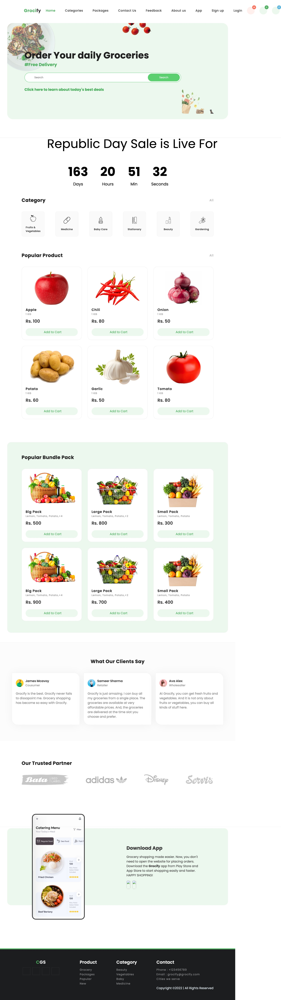
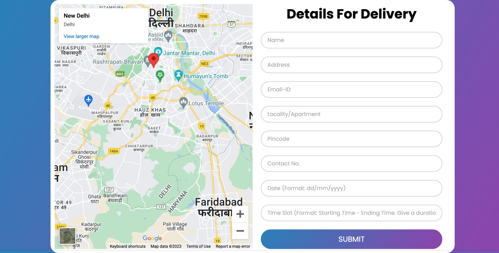
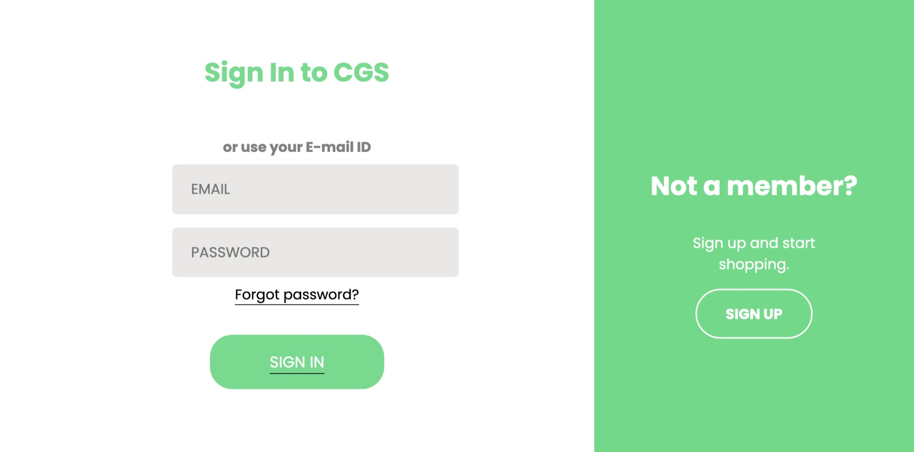
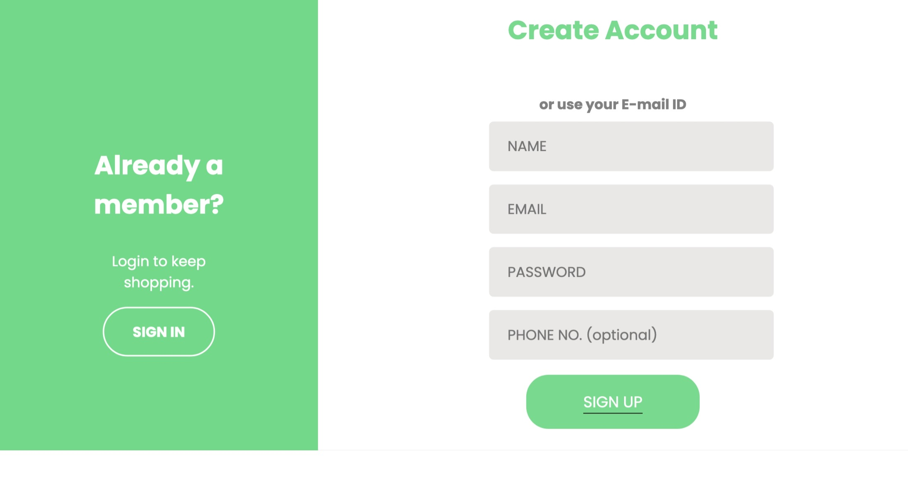
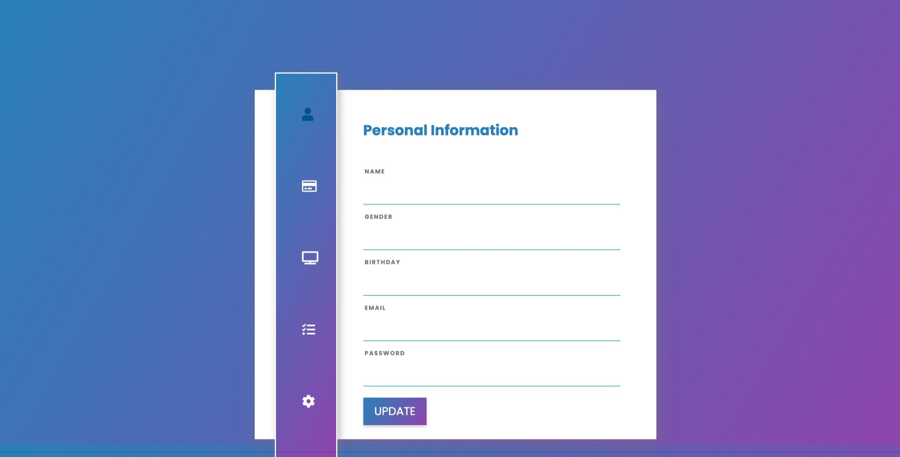
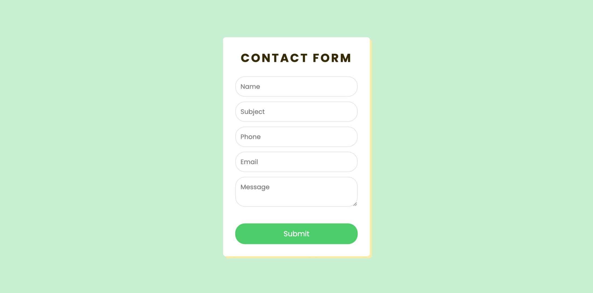
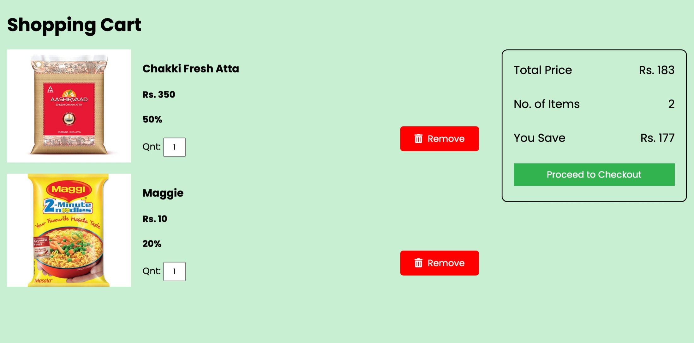
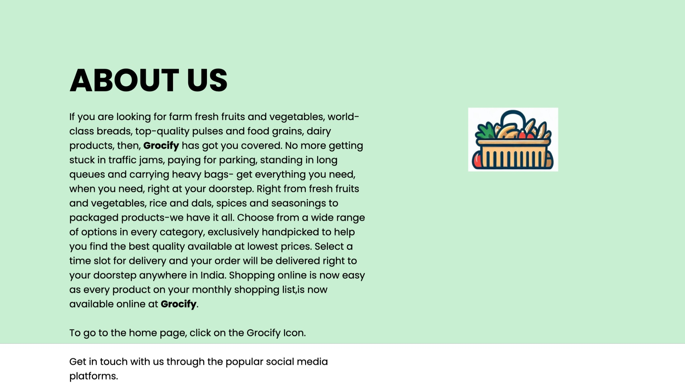

# Chitkara-Grocery-Store

# Grocify

Grocify is a grocery store website based on pure HTML, CSS and JS. It allows users to browse, search and buy various products from different categories such as fruits, vegetables, dairy, bakery, etc. Users can also view the latest offers and discounts on selected items and save money on their purchases.

This project is only for educational purpose and does not include any database and serverside backend

### Project Setup

You can simply run the porject on liveserver extension in Visual Studio Code

Open the project folder in Visual Studio Code -> Install Live Server Extension -> Open the index.html -> Right Click and select Open With Live Server

### The website has the following features:

- Home page: The home page displays a welcome message, a navigation bar, a banner with the latest offers, and a grid of featured products.
- Product display: The product display page shows the details of a selected product, such as name, price, description, rating, and reviews. Users can also add the product to their cart or wishlist, or share it with others.
- Checkout: The checkout page allows users to review their cart items, apply coupons, choose delivery options, and proceed to payment.
- Sign in: The sign in page enables users to log in to their account using their email and password. Users can also choose to remember their credentials or reset their password if they forget it.
- Sign up: The sign up page enables users to create a new account by providing their name, email, password, and phone number. Users can also opt-in to receive newsletters and promotional emails from Grocify.
- Profile: The profile page displays the user's personal information, order history, wishlist, and preferences. Users can also edit their profile details, change their password, or delete their account.
- Setting: The setting page allows users to customize their website experience, such as choosing a theme, language, currency, and notification settings.
- Payment: The payment page allows users to complete their purchase by choosing a payment method, such as credit card, debit card, PayPal, or cash on delivery. Users can also enter their billing and shipping address, and confirm their order.

Grocify is a simple and user-friendly website that aims to provide a convenient and enjoyable online shopping experience for customers. It is a project developed by a team of web developers who are passionate about creating web applications using pure HTML, CSS and JS.

